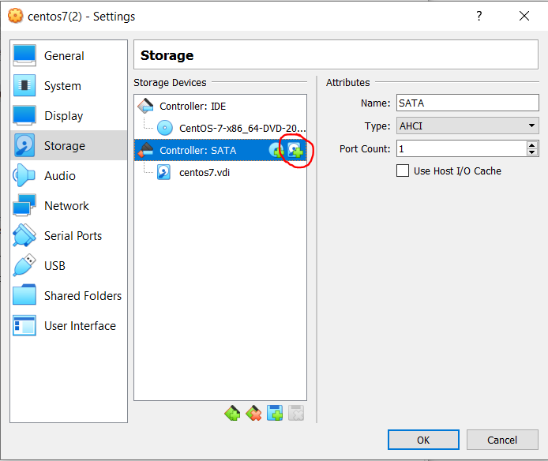

# LINUX WEEK 10 (05-11-2021)
## Notes
### Three Important Command in Linux
Basicaly grep, sed, and awk have a basic fuction to search files for lines that contain certain pattern.
1. `$ grep` : used to find the content that match particular pattern in the execution output or file
2. `$ sed` : sed is stands for stream editor, this command have a function to search, find and replace, insertion or deletion on file.
3. `$ awk` : this command provides a scripting language for text processing, it allows you to define variables, use string and arithmatic operators,use controlflow and loops, and generate formatted reports

### Mount
To make a storage device or filesystem become accessible and attaching it to an existing directory, you need to mount the device into specific folder. By mounting device it means you build a relation between your machine and the device. For example to mount the optical drive you can use the following command 
```
# mount -t iso9660 /dev/sr0 /media
```

## How To
### Add Storage into VirtualBox
If your memory almost full you can add the storage. Go to the storage setting and click the button that I've circled below



after you add the new storage you can see the new storage when you type `$ lsblk` but you still can't use this storage, you need to type the following command
```
# fdisk /dev/sdb
```
for the setting first you need to type n, after that choose the primary by typing p, leave the setting into default and last type w to save the setting. Next you need to type the following command
```
# mkfs -t xfs /dev/sdb1
```
Then create a new directory
```
# mkdir /data
```
Mount the new storage to the new folder
```
# mount /dev/sdb1 /data
```
Now you already can use the new storage.