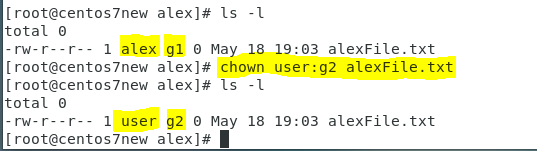

# LINUX WEEK 11 (05-18-2021)
## Notes
### Manage Linux User Account
Linux is a multiuser environment. Each user can be added into several groups and each group will have unique ID (GID).

#### 1. Group Information
If you type command `$ cat /etc/group` you will see an output like shown in the picture below


as you can see there are several group that written there, as an example `user:x:1000:user` the first "user" is the group name, 1001 is the GID, and the last "user" is the username of user in this group, there could be more than one user in one group. 

For group ID, the group with `ID ≥ 1000` is a user defined group while the group with `ID < 1000` is a system group.

#### 2. User Information
If you type command `$ cat /etc/passwd` you will see the user information like shown in the picture below


from the text above I take one line as an example
```
alex:x:1010:1001::/home/alex:/bin/bash
```
here "alex" is the username, "x" originaly was the space for user password but now it has been moved to `/etc/shadow`, in the third column 1010 is user ID, 1001 in the forth column is the group ID, the fifth column is for comment, the sixth column show home directory for the user and the last column used to show shell directory. For normal user the shell directory is `/bin/bash` while for system account is `/sbin/nologin`.

Just like in group, the user with `ID ≥ 1000` is a normal user while user with `ID < 1000` is the system user.

## Command
### 1). Add new user into Linux
To add a new user you can type the following command
```
# useradd [username]
```
after that if you type `$ cat /etc/passwd` command you will able to see the new username there

Option :
`-c` set the user's comment
`-g` set the user's main group
`-G` set the other groups
`-u` set the user ID

### 2). Modify user setting
To modify some user information you can type the following command
```
# usermod [options] [username]
```
The options is the same like the options that use to add a new user.

### 3). Delete user
The delete the user account, type the command below :
```
# userdel [username]
```
the above command will only delete the user account but the user home directory will still there. To delete the user acount and it's home directory add `-r` parameter to the command :
```
# userdel -r [username]
```

### 4). See UID, GID, and groups information from a user
```
$ id [username]
```
The command above will show the information below :
1. UID : the user ID
2. GID : main group ID
3. groups : show all the group that this user join

### 5). See user group information
To see the information about user's group you can type the following command
```
$ groups [username]
```

### 6). Change user password
You can change the specific user password by typing the command below
```
# passwd [username]
```
remember to switch into root to change the user password

### 7). Change file owner
when you in root mode you can change the file owner
```
# chown [new user owner][:[new group owner]] FILE
```
See the example in the picture below


