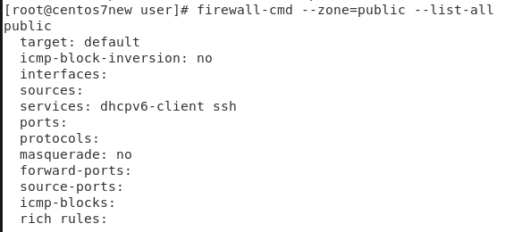
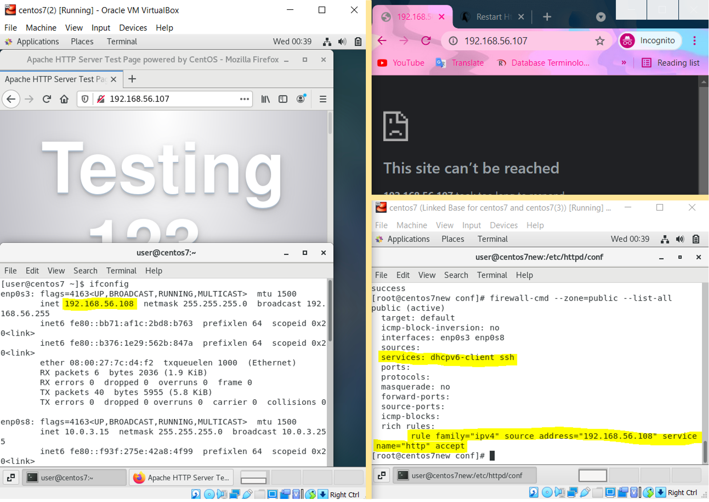

# LINUX WEEK 12 (06-01-2021)
## Linux Firewall
Firewall is a set of a rules. In linux there are several tools that can be use for managing the firewall including iptables and firewalld. The main difference between this two tools is by using iptables to set up new rules then it will flush the entire rules set unlike firewalld that won't re-creating of all rules, it will only adding the difference into rules.

### Firewall Zones
1. `Public` : default setting is to reject all connection. Only selected common and mostly safe incoming connections are accepted.
2. `external` : in this zone it will hide your address in private network behind a public IP address.
3. `dmz (demilitarized zone)` : This zone is intended for computers that are publically accessible, located on an organization's external network with limited access to the internal network.
4. `home`, `internal`, `work` : the default setting in this zone will accept most of the connections. This zones setting are suitable for use in home setting where you trust other users.
5. `trusted` : all connection are allowed

## Configure HTTP using firewalld
### 1). add and remove port in firewall
you can add ports into the firewall by using this command

```
# firewall-cmd --zone=public --add-port=8000/tcp
```
the above command will add port 8000 to public zone, with the protocol is tcp.

we also can set a range of port like the command below and add `--permanent` parameter to make add the rule into permanent firewall. 
 
```
# firewall-cmd --zone=public --permanent --add-port=5000-6000/tcp
```
while to remove a port from firewall the command line is almost the same like when you try to add a new port but you need to change the `--add-port` parameter with `--remove-port`.

```
# firewall-cmd --zone=public --remove-port=5000-6000/tcp
```
### 2). add and remove server in firewall
You also can add a server into a firewall, for example the command below will make http can also access your linux system in public zone
```
# firewall-cmd --zone=public --permanent --add-server=http
```
while to remove it you can use the following code
```
# firewall-cmd --zone=public --permanent --remove-server=http
```
### Allow connection for specific user in public zone
Using firewalld we can set our firewall to enable connection for specific user. In public zone, it will enable http service for default, you can check it by type command :
```
# firewall-cmd --zone=public --list-all
```
the output will looks like this. As you can see in services part it only include `dhcpv6-client` and `ssh`.



but we can write a rule to enable certain user accessing our system using http, see the command below
```
# firewall-cmd --zone=public --add-rich-rule 'rule family="ipv4" source address="[IP address]" service name="http" accept'
```
fill the IP address with the IP from user that you want to give http access.

As an example I use 2 VM, `centos7(2)` with IP address `192.168.56.108` and `centos7` with IP address `192.168.56.107`. I will use `centos7` to host an http set the firewall zone into public but I will open http connection only for `centos7(2)`. The result is shown in image below where I can open the http in my `centos(7)` but I can't access it in my host browser.

