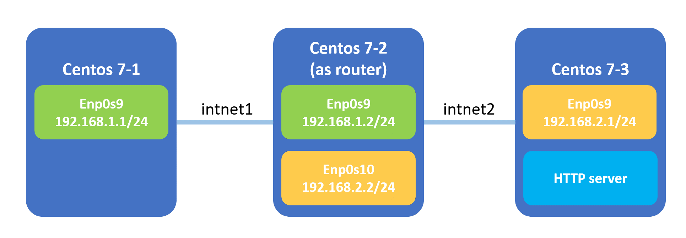
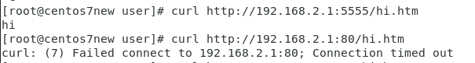

# LINUX WEEK 12 (06-08-2021)
## Iptables
iptables is like the opposite of firewalld, if you add rules in iptables then the traffic will be dropped, and if you don't set any  rules then all access will be accepted. While in firewalld its default is to reject the traffic, so if we don't set a rule then it will reject the access. The iptables places rules into predefined `chains` :
1. `INPUT` - All packets destined for the host computer
2. `OUTPUT` - All packets originating from the host computer
3. `FORWARD` - All packets that passing through the host computer. This chain is used if you are using your computer as a router.

In receiving the traffic there are 2 most common actions that referred to as targets, `DROP` to drop a packet and `ACCEPT` to acept a packet. The action for each packet would depend on the rules whether to drop or accept the packet.

## Writing a Simple Rule in Iptables
For example if we have 3 devices `centos 7-1`, `centos 7-2` as a router, and `centos 7-3`. `centos 7-1` and `centos 7-2` are connected by internal network intnet1, while `centos 7-2` and `centos 7-3` are connected by intnet2.



### Drop Traffic from IP Address
you can use IP Address to block all traffic coming in on a specific interface by typing the following command :

```
# iptables -A INPUT -s 192.168.1.0/24 -j DROP
```

Parameter :
* A : append (add a new rule)
* S : source
* J : jump (to execute)

### Drop Traffic Processed by FORWARD and OUTPUT
The following command will drop all traffic processed by FORWARD, from port 80

```
# iptables -A FORWARD -p tcp --dport 80 -j DROP
```

but if we change the httpd settings in `centos 7-3` to listen to port 5555 and we try to curl it again at port 5555 from device `centos 7-1` then we will be able to access it.



as you can see from the image above, the device access was accepted when the port is 5555, when we set it's port into 80, the traffic was droped as it doesn't show any result until the connection timed out.

While in the command below, it will drop all traffic processed by OUTPUT in port 80

```
# iptables -A OUTPUT -p tcp --dport 80 -j DROP
```

## Back Up The System File
To back up a file we need a  container to pack the file, this process called as `package`. But, this way the package size will be big, so we need to compressing the file to make its size smaller. The file that has been compessed called as `compression`.

To pack all of the files into one file we can use tar command written below :

```
$ tar cvf filename.tar [dirname]
```

while to unpack it we can use

```
$ tar xvf filename.tar
```

There are several ways to compress the file :

#### gzip (*.tar.gz)
Compress :

```
$ tar zcvf filename.tar.gz [dirname]
or
$ gzip filename
```
Decompress :

```
$ tar zcvf filename.tar.gz [dirname]
or
$ tar zxvf filename.tar.gz
```

#### bzip2 (*.tar.bz2)
Compress :

```
$ bzip2 filename
```
Decompress :

```
$ bunzip2 filename
```

#### .Z (*.tar.Z)
Compress :

```
$ compress filename
```

Decompress :

```
$ uncompress filename
```

#### zip (*.zip)
If we want to transfer a large file from windows into Linux we can compress the file into zip since both Windows and Linux can unzip the file.

Compress :

```
$ zip -r filename.zip [dirname]
```

Decompress:

```
$ unzip filename.zip
```

#### rar (*.rar)
In your linux OS you might need to install rar by following the step in this website [linuxhelp.com](https://www.linuxhelp.com/how-to-install-rar-unrar-on-centos-7) before you can use it to compress file.

Compress :

```
$ rar a filename.rar [dirname]
```

Decompress :

```
$ unrar e filename.rar
```