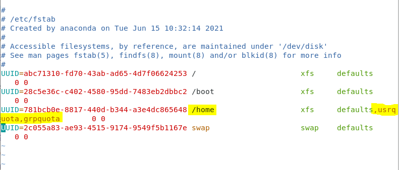

# LINUX WEEK 15 (06-15-2021)
## Notes
## Two Kind of Times in Linux
### 1. Hardware time
A hardware time is handeled by BIOS it will handle the time job. If you turned off the device, you will find that BIOS is still working.
### 2. System time
System time is handeled by Linux OS, when you boot the system then system will read the hardware time and handle system time.

## NTP (Network Time Protocol)
NTP is a way of keeping correct time on computers. ntpd, the NTP daemon will periodically queries a public time server and adjusts your system time.

## Crontab
Crond have connection with time. We can use it to do designated job in certain time, for example set a schedule to backup the data in our device every 2 a.m of January 20.

### Below is the Cron table format :

```
Minute (0 - 59)
|
|   Hour (0-23)
|   |
|   |   Day of Month (1-31)
|   |   |
|   |   |   Month (1-12)
|   |   |   |
|   |   |   |   Day of the Week  (0-6) (sunday=0 or sometimes 7)
|   |   |   |   |
*   *   *   *   *   command_to_execute
```
example :
```
29 9 15 8 * (8/29 9:29 we don't care the day of the week)
0 17 10 * * (Each month, day 10th at 17:00)
0 4 * * 6 (Each Saturday, 4:00)
* 4 * * 6 (this would be execute at 4:01, 4:02, ... 4:59) Each minute execute once
*/2 4 * * 6 (this means 4:00, 4:02, 4:04, ... 4:58) Executed every 2 minutes
```

### Set multiple values in a field :
 > `asterisk (*)` : specifies all possible values for a vield (e.x every minute, every hour, every day, etc).
 > `comma (,)` : specifies a list of values (e.x 2,4,6,7)
 > `dash (-)` : specifies a range of values (e.x 1-4 which equal to 1,2,3,4)
 > `slash (/)` : specifies list of values that divisible by n (e.x */3 is equal to 0, 3, 6, 9, etc)

### Crontab options :
```
$ crontab [options]
```
 > `-e` : install or update job in crontab
 > `-l` : list crontab entries
 > `-u username` : specifies which user whose crontab is to be tweaked. Need to be noted that in su it's important to always use the -u option to avoid confusion.

## How to limit user storage in Linux
1. You need to enter su mode and modify /etc/fstab. Beside /home you will find defaults, add usrquota and grpquota beside defaults like shown in the image below.

<br>

after that do the following command :

```
# mount -o remount /home
# mount | grep /home
```

after excuting the second command you will get an output that look like this

```
/dev/sda2 on /home type xfs (rw,relatime,seclabel,attr2,inode64,usrquota,grpquota)
```

if you see `noquota` instead of `usrquota,grpquota` then you need to reboot your system.

Then, to limit the user storage you can type the following command

```
# xfs_quota -xc 'limit bsoft=10m bhard=12m username' /home
```
b from bsoft and bhard stand for block.

in setting storage limit, there are 2 kinds of storage limit :
1. `soft limit` : if your usage is beyond soft limit it will give you a warning message.
2. `hard limit` : you can't use the memory pass this limit

## Command

### 1). check and change timezone
check timezone :
```
$ timedatectl
```

change timezone
```
# timedatectl set-timezone Asia/Tokyo
```

### 2). formatic output from system time
You can get a formatic output from the system time by setting it's string format
```
$ date +%Y%m%d
$ date +"%Y:%m:%d"
$ date +"%Y/%m/%d"
$ date +'%H:%M:%S"
```

* `%Y` : Year
* `%m` : Month
* `%d` : Date
* `%H` : Hour
* `%M` : Minute
* `%S` : Second

you even can make a new file and fill it's name by using the formatic output of time
```
$ touch $(date +%Y%m%d)
or you can type
$ touch `date +%Y%m%d`
```

### 3). synchronized time
You also need to synchronized the time on your system with the standard time to make it accurate. You can type the following command to synchronized your system time
```
# ntpdate time.stdtime.gov.tw
```
and then write it back to hardware clock
```
# hwclock -w
```