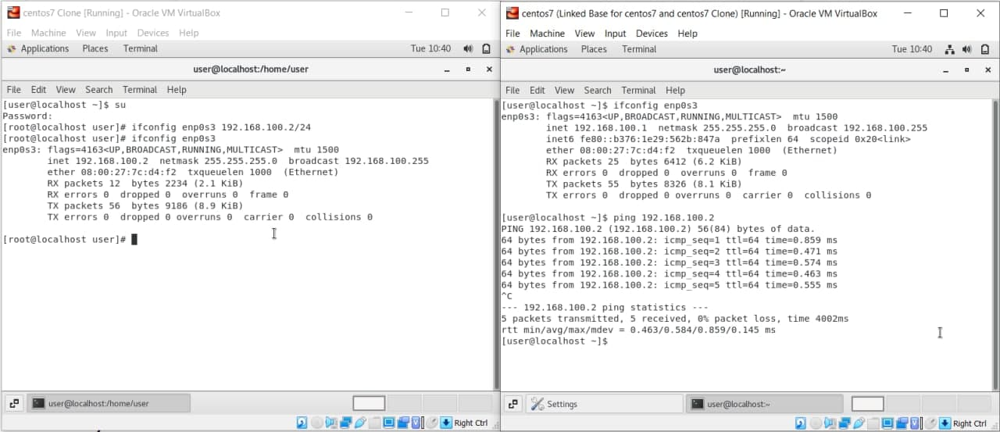

# LINUX Week 2 (23-02-2021)
## 2 Type of Cloning in VM :
* Full-clone : this clone method is an independent copy of a VM and it won't share anything with the parent VM after the cloning operation. The ongoing operation of full clone is entirely separate from it's parent

* Linked clone : this clone method is a copy of VM that shares virtual disks with it's parent. This method will conserves disk space, and allows multiple VM to use the same software installation

summary the main difference is that full-clone are an independent VM while linked-clone is a dependent VM because linked-clone need the parent virtual disk as their base-virtual-disk.

## Difference between VMware and VirtualBox
VMware is virtualization software that can run multiple operating systems, it can conect to the real machine and internet by using a single host while VirtualBox is an Oracle tool to provide host-based virtualization, it can conect to the real machine but it need a bridge to conect to the internet.

## Built internal network
In VirtualBox we can built an internal network and let each devices in it can communicating.

> set each devices internal network to conect to the same internal network

> set each devices IP address and using one device to ping the other device