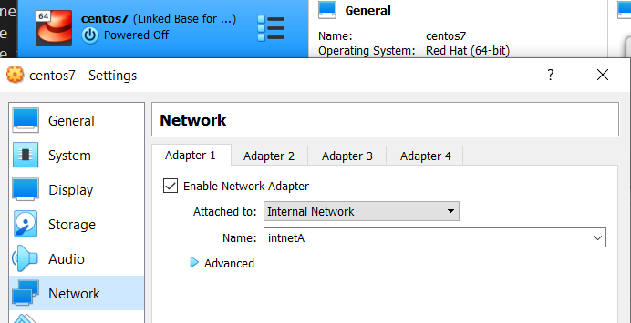
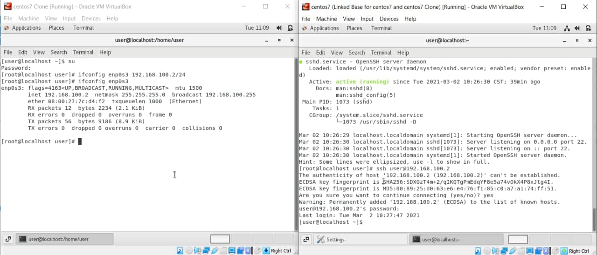

# LINUX Week 2 (23-02-2021)
## 2 Type of Cloning in VM :
* Full-clone : this clone method is an independent copy of a VM and it won't share anything with the parent VM after the cloning operation. The ongoing operation of full clone is entirely separate from it's parent

* Linked clone : this clone method is a copy of VM that shares virtual disks with it's parent. This method will conserves disk space, and allows multiple VM to use the same software installation

summary the main difference is that full-clone are an independent VM while linked-clone is a dependent VM because linked-clone need the parent virtual disk as their base-virtual-disk.

## Difference between VMware and VirtualBox
VMware is virtualization software that can run multiple operating systems, it can conect to the real machine and internet by using a single host while VirtualBox is an Oracle tool to provide host-based virtualization, it can conect to the real machine but it need a bridge to conect to the internet.

## Built internal network
In VirtualBox we can built an internal network and let each devices in it can communicating.



> set each devices internal network to conect to the same internal network


> set each devices IP address by typing for example "ifconfig enp0s3 192.168.100.2/24" like what's wrote on centos7 clone terminal (left side) and using one device to ping the other device. Here I use centos7 (right side) to ping centos7 clone (left side).

## Make Two Devices Communicating by Using Cloud
Actualy there are two ways to conect two devices, by using SSH or Telnet. But it's better to use SSH instead of Telnet in conecting two devices since it's security.



> conecting "centos7 Clone" (left side) to "centos7" (right side) by typing "ssh user@192.168.100.2" in centos7.

## Linux Command
to see the ip configuration write the command below in terminal
```
$ ifconfig
```

below is command to reset the modification in IP address, suppose that device network name is epn0s3
```
$ ifconfig enp03s 0
```

using terminal to set up IP address. (New IP = 192.168.100.1, Net Mask = 24)
```
$ ifconfig enp03s 192.168.100.1/24
```
