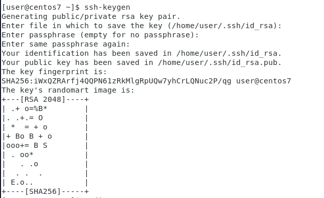
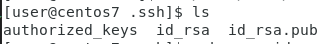
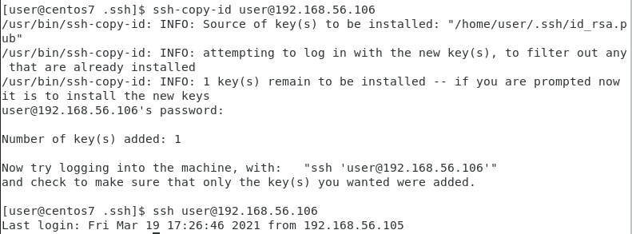
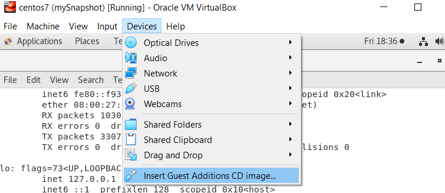

# LINUX WEEK 3 (03-09-2021)

## Notes
### Red Hat
Red Hat is an enterprisee software company with an open source development model. This company is devided into 2 part, Centos and Fedora. If they develop new version, they will give it to Fedora. So the source in Fedora is up to date but still unstable. After this version become stable then it will be put in CentOS for free version and also back to Red Hat. The things is in CentOS if there is any problem then you need to solve it by yourself. While Red Hat is the paid version and provide service to help you to solve the problem.

### IP 0.0.0.0
If you see IP 0.0.0.0 this means it listen to any interface.

<br>

## How to
### 1. Set up SSH passwordless login
First we need to generating a new SSH key pair by type the following command.
```
$ssh-keygen
```
Press enter to accept saving the file in the default folder
```
Enter file in which to save the key (/home/username/.ssh/id_rsa):
```
Next you will be asked whether you want to add passphrase or not. This passphrase will let you have an extra layer of security.
```
Enter file in which to save the key (/home/yourusername/.ssh/id_rsa):
```
The process would looks like this :



Next cd to your id_rsa file, the folder path are written at the above line just like the picture above. Make sure that the SSH key are generated by type the following command :



Now that the SSH key has already been generated, to set up a passwordless login we need to copy the public key into the server that we want to manage. The following command should copy your id into the server.
```
ssh-copy-id remote_username@server_IPaddress
```
next you need to input the password and then relogin into the server.



Now you should be able to login to the server without being prompted to fill in the password.

<br>

---

### 2. Install VirtualBox Guest Additions in VMBox on CentOS and Red Hat
First open the menu bar "Devices" and choose "Insert Guest Addition CD Image..."



open the terminal and type "su" to switch to the root user.
```
$ su
```
create a new directory as the mount point for the CD drive
```
$ mkdir /media/VirtualBoxGuestAdditions
$ mount -r /dev/cdrom /media/VirtualBoxGueestAdditons
```
Update and install the kernel that required for building external kernel modules
```
$ yum update kernel
```
after kernel is updated, reboot your VM before continue to type the commands below.
```
$ yum install gcc kernel-devel kernel-headers
```
```
$ KERN_DIR=/usr/src/kernels/your_kernels_version
```
you can check your kernel version by type this command :
```
$ uname -r
```
sample output :
```
2.6.18-194.11.1.el5-x86_64
```
<br>

## Command
### 1). echo
```
$ echo "some string"
```

> this command will print out the string in your terminal.

```
$ echo "hello world" > hello.htm
```

> this command wouldn't print the string in your terminal, it will save the string in file "hello.htm" instead.

<br>

---
### 2). Show file content

```
$ cat filename
```

> cat command is used to show the file content in your terminal.

<br>

---
### 3). Create web server

```
$ sudo python -m SimpleHTTPServer 80
```

> this command will create a web server that will listen to the port 80

<br>

---

### 4). Show current working directory

```
$ pwd
```

> this command will print the path of your current working directory