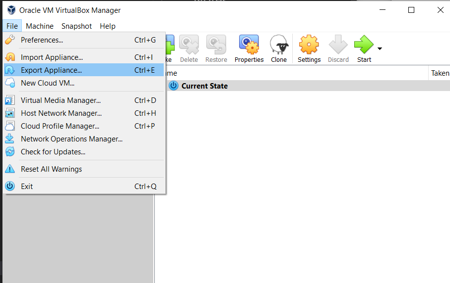
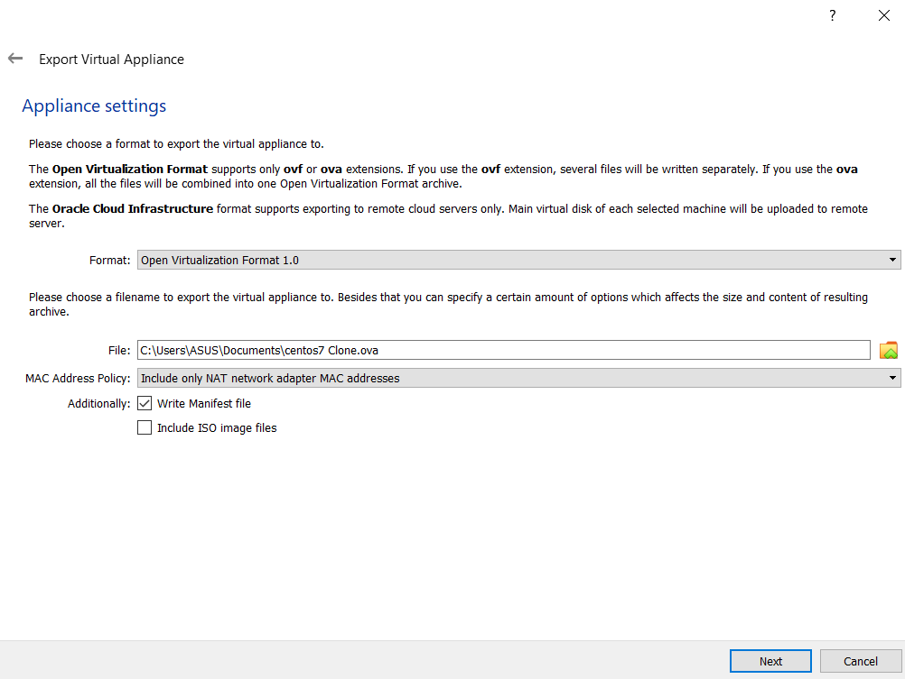
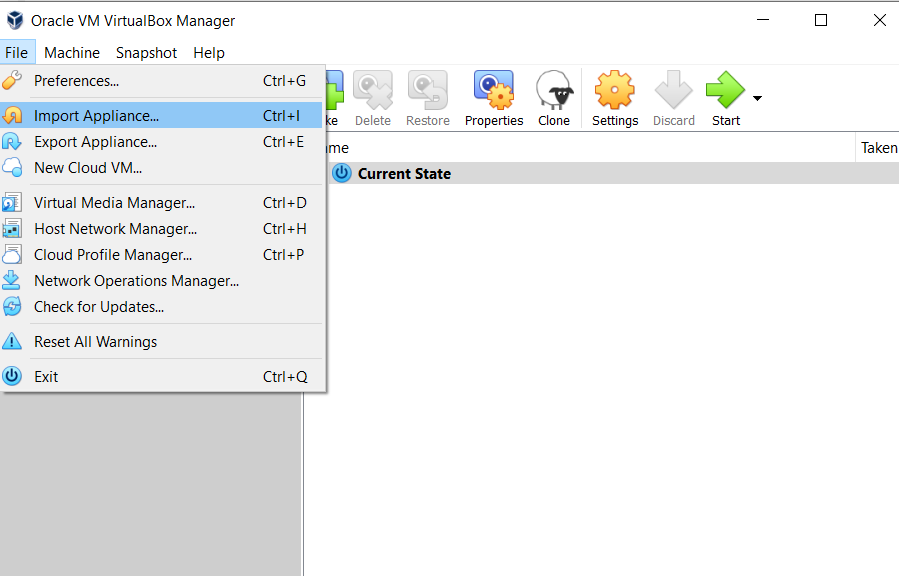
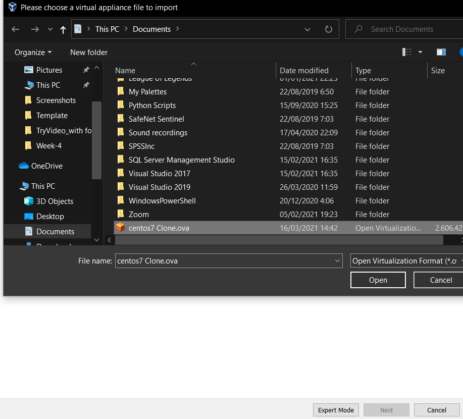

# LINUX WEEK 4 (03-16-2021)

## Notes
### GNU General Public License
The GNU GPL is a free software licenses written by Richard Stallman, founder of the Free Software Foudation (FSF) for the the GNU Project. This software has been widely used and guarantee the end users freedom to run, study, share, and modify the software.

### Linux Filesystem Hierarchy Standard (FSH)
FSH defines the directory structure and the purpose of directories in Linux. The image below show how directory structure in Linux looks like.


### 1. / : The root directory

All files and directiories in Linux are located under root, represented by '/'.

### 2. /bin : Binaries
This directory contains executable files for basic shell commands (ls, cd, etc).

### 3. /dev - Device files
/dev directory contains special files that represent the device. For example:

* /dev/null : a special device that won't prodeuces any output and automatically discards all input.
* /dev/zero : contains infinite sequence of 0
* /dev/random : make an infinite sequence of random number

### 4. /etc : Configuration files
this directory contains system-wide configuration files, while user-specific counfiguration files are located in specific user's home directory.

### 5. /home : Home Folders
This directory contains user persolan diirectories. It contains the user's data files and user-specific configuration files.

### 6. /usr - User binaries and program data 
Contains binaries, libraries, documentation, and source code for second level programs.

Directory | Purpose
----------|---------
usr/bin | contains basic user commands
usr/sbin | contains additional commands for the administrator
/usr/lib | contains the system libraries
/usr/share | contains documentation or common to all libraries

### 7. /lib - Shared libraries
Librariesis is basically is a codes that needed by the binaries in the /usr/bin and /usr/sbin

### 8. /sbin - System binaries
/sbin is almost the same as /bin. The 's' before bin can be super or sudo, which means the binaries in /sbin can only be run by root or a sudo user.

### 9. /tmp - Temporary files
This directory have a purpose to holds temporary files.

### 10. /var - Variable data files
This directory used to store runtime information such as caches,system logging, etc.

### 11. /boot - Boot files
Contains files of kernel and boot image.

### 12. /proc - Process and kernel files
This directory provide running process and kernel parameters as files.

### 13. /opt - Optional software
Used for installing/storing optional application software packages.

### 14. /root - Home directory of root
This directory work as the home directory of the root user.

### 15. /media - Mount point for removable media
Mount ponts for removable media such as USB disk, SD card, DVD.

### 16. /mnt - Mount directory
This directory is similar to /media, but instead of mounting the removable media, it is used by syset administrators to manually mout a filesystem.

### 17.srv - Service data
this directory contains data for services provided by the system.

---

## How to
### 1. Export and Import VM
If we want to move our project into another PC or we want to send it to other person we can't just copy and paste our project folder. If we do it this way some important file may not be copied. It's better if we export the file into .ova extention and we can import it in another virtual machine.



> open File > Export Applience... and choose which virtual machine that you want to export

<br>



> You can set where to save the file by clicking the folder icon. In MAC Address Policy you can decide which network adapter that you want to include. After your file have already exported, you will find ".ova" extention file.

<br>



> open File > Import Appliance... to import the file

<br>



> choose the ".ova" file to import it into your project 

---

## Command
### 1). Shutdown Linux
There are several commands that you can use to shutdown Linux
```
$ power off
    or
$ halt -p
    or
$ shutdown -h
```

<br>

---
### 2). Restart Linux
If you want to restart your VM in Linux you can type
```
$ reboot
    or
$ shutdown -r
```

<br>

---
### 3). Grep

grep (globally search for regular expression and print out) is a command that commonly used in filtering search file result.
```
grep [options] pattern [files]
```
grep options description:

* -c : will only print the count of the lines that match a pattern
* -i : ignores, case for matching
* -v : this will prints out all lines that do not matches the pattern