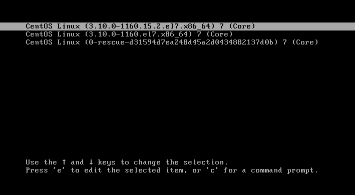

# LINUX WEEK 5 (23-03-2021)
## Notes
### Six stages of Linux booting process
1. BIOS : Basic Input/Output System will loads and executes MBR boot loader.
2. MBR : Master Boot Record will executes GRUB.
3. GRUB : the Grand Unified Bootloader will show a simple menu where you can select which kernel that you want to load.


4. Kernel : in this stage the kernel that was selected by GRUB will execute the /sbin/init

5. Init : init executes runlevel programs.
> * run level 0 - halt
> * run level 1 - Single user mode
> * run level 2 - Multiuser, without NFS
> * run level 3 - Full multiuser.target (text mode)
> * run level 4 - unused
> * run level 5 - X11 graphical.target (graphic mode)
> * run level 6 - reboot

6. Runlevel : Runlevel programs are executed from different directories depending on run level.

> * run level 0 - /etc/rc.d/rc0.d/
> * run level 1 - /etc/rc.d/rc1.d/
> * run level 2 - /etc/rc.d/rc2.d/
> * run level 3 - /etc/rc.d/rc3.d/
> * run level 4 - /etc/rc.d/rc4.d/
> * run level 5 - /etc/rc.d/rc5.d/
> * run level 6 - /etc/rc.d/rc6.d/

### Difference between history and .bash_history content
history and .bash_history both show the command history, but because .bash_history is a file so the command history would be written there after a specific periode of time. So all the command history would first be wrote in memory, since if it need to write to the file for each command that you have typed it will be not good for performance.

### About Shell
Shell is a middle software, it will interprete user language into a language that kernel can undestand, after kernel finished the process, it will interpret the result into the language that user can understand

## Command
this command will reexecute the previous command
```
$!!
```

---

if you type "$gedit a.txt" you still can do input in your terminal, but can't type command because you terminal is currently editing a.txt file. Type it like the command below to put the process on the background so you can continue to type command while editing the file
```
$ gedit a.txt &
```

---

command sed means string edit e.x.
```
$ sed '/^$/d' a.txt
```
in this commands "^$" means enter character while "/d" means delete, so this command will search for a.txt file and delete each enter in it.

---

to show who is currently in system you can type:
```
$ who
```
or to show more information about it, type :
```
$ w
```

## Shorcut Keys In Terminal
* ctrl + A : will bring you to the first word in your command
* ctrl + E will bring you to the end of your command
* ctrl + C to end the process
* ctrl + Z will stop the program and put it in the background. e.x output = [1] Stopped ping 8.8.8.8, to run it agai you need to type "$fg 1"