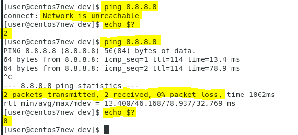
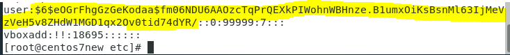

# LINUX WEEK 6 (30-03-2021)
## Notes
### Linux File Management

You need to know that everything in Linux system is a file, even a device is also a file. There are two ways to describe file location in Linux system, by using absolute path or relative path.


1. Absolute path is a full path of a file. It will describe the file path started from "/" (root). For example the absolute path from "a.txt" would be /home/nubz/a.txt.

2. Relative path is path of a file that can be started from either its parent directory or its current directory. There are 2 important relative path notation that we often meet in Linux :
> * (.) means current directory. For example if we are currently in /home/nubz directory and we want to access a.txt, we can simply write ./a.txt.
> * (..) means parent directory. Parent directory is a directory that contain current directory. From the picture above parent directory from nubz is home, and parent directory from bin is usr. For example if we are currently in /home/nubz, then if we want to access b.txt file we can write ../b.txt

### Linux /dev/null
This file is present in every single Linux system. unlike other virtual files, instead of reading it is used to write. Everything that you write to /dev/null will be discarded. Before continue to /dev/null function we need to know 3 important things :
> * 0 : standard input (stdin)
> * 1 : standard output (stdout)
> * 2 : standard error output (stderr)
> normally 0 rever to keyboard, while 1 and 2 rever to monitor.

as an example, if you type a command like "$ ping 8.8.8.8" it will show the standard output.



From the picture above you can see that at the first time I didn't connect my device into internet, so when I try to ping 8.8.8.8 it show an error message "Network is unreachable" and when I chech the exit status from the previous command by typing "$ echo $?" , it return 2 which rever to standard error output. While after I connect the device into internet it success to ping 8.8.8.8 and when I check the exit status, it return 0 which means the program has been executed successfuly.

As you know if we pinging 8.8.8.8 it will keep showing the successful ping results. But what if we only want to see the result when the ping is fail? We can put all the successful ping into /dev/null so that we will only see the fail ping. You can type the following command for that :
```
ping google.com 1> /dev/null
```
this way all of the stdout will go to /dev/null, leaving only the error messages.

## Command
### 1). Show File Permission
Go to dev directory and type the following command :
```
$ ls -al
```
you will see something like crw or brw. Here c means character device (e.x keyboard and mouse), b means block device (e.x USB Disk or harddrive), and if you see lp it means printer (lp included as crw).
The output structure will show the privilege for owner, group, and others, it goes like this :
```
-       ---     ---     ---
File    owner   group   others

The file could be :
    - : file
    d : directory
    c : character
    b : block
    l : link
    s : socket

for example we see the privilege for owner :
c rwx------.
    r : read
    w : write
    x : executable
    *note that this rwx is for file only
while for directory
    r : you can execute ls for that directory
    w : whether you can edit that dictionary (e.x. remove file, add file, rename file)
    x : whether you can enter that directory or not

another way to describe privilage can also be written like 600, 644, this means :
    6       0       0
    110     000     000
    rw-     ---     ---

    6       4       4
    110     100     100
    rw-     r--     r--
```

---
### 2). Create Empty File in Linux
To create an empty file in Linux you can simply type this command :
```
$ touch a.txt
```
if you try to check the "a.txt" content by typing "$ cat a.txt" you'll see that a.txt is an empty file.

---
### 3). Show Block Devices Information
To see the information about the block devices such us sda (SCSI harddisk) and sr0 (CD ROM) type this command :
```
$ lsblk
```
ls : list, blk : bulk

---
### 4). Passwd and Shadow Content
cd to etc and type the following command :
```
$ cat passwd
```
this passwd contain user account information, but even though its name is passwd it doesn't contain the information about the user password. The user password is saved in shadow file. To see it's content you need to switch to super user and cat it.
```
# cat shadow
```
this shadow file contain the encrypted password of the user



> Encrypted user password in shadow.