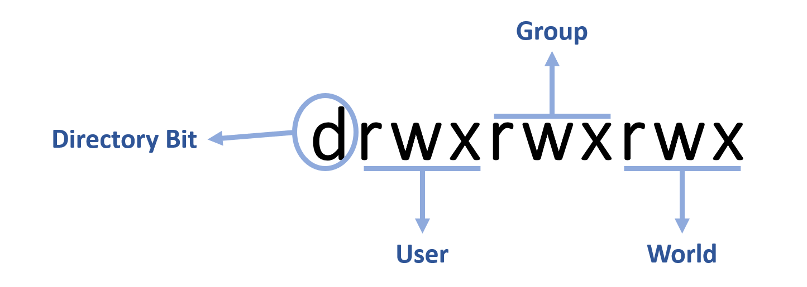

# LINUX WEEK 7 (04-13-2021)
## Notes
### Linux File Permissions
You need to know that Linux uses a combination of bits to store the permissions of a file. In the previous notes we already know a little about file permissions in Linux. `File permissions` is a sets that permit certain users to  run specific programs. It listed in a series of three different roles : user who owns the file, group, and world (everyone else).



<br>

---

<br>

### SetUID, SetGID, and Sticky Bits in File Permissions
1). `SetUID` is a Linux file permission setting that allows a user to execute file or program with the permission from the owner of that file (e.x. sudo). To set up setUID, we can type the following command :
```
# chmod u+s <filename>
```
make sure that the file is executable otherwise you will see a capital 'S' instead of lowercase 's' which means the setUID is set but the user that own the files doesn't have a permission to execute it.

2). `SetGID` make a procell will run as the group that owns the file when executed (e.x. crontab). To set up setGID we can execute the command below :
```
$ chmod g+s <filename>
```

3). `Sticky Bit` is a special permission that will make the files in a directory only can be removed by the owner when setted up. To set it up on a file, type the following command :
```
chmod +t <filename>
```
<br>
this three special permissions are very useful for separating the ability of user or group in accessing the file.

<br>

---

<br>

### Link in Linux
Link is like a shortcut in Windows system. It give us a quick access into the original file. In Linux there are 2 kinds of link :
- Symbolic link
- Hard link

The difference between this two link is :
1. In symbolic link you can do cross partition link, but hard link can't do a cross partition link
2. even it's in the same disk, hard link can't make a link for a directory. It only create link for a file while symbolic link can do for both file and directory.
3. Symbolic link would return invalid link when you delete the destination file, while hard link still can access it.
4. When you create a link of a file, its attribute would be the same as the original file but for hard link you can modify its attribute from its link file.

<br>

---

<br>

## Command
### 1). Copy File
This command will copy a file, it enable us to set the new file location and even rename it
```
$ cp <filename> <file destination>
```
for example, the following command would copy "myFile" into tmp directory and name it as "z".
```
$ cp myFile /tmp/z
```
---
### 2). Move File
The following command is used to move the file into a new file path, but it often used to change the filename also
```
$ mv <filename> <file destination>
```
---
### 3). Remove File and Directory
to remove a file you can type :
```
$ rm <filename>
```
attribute :
> * -f (force) : delete the file without asking for permission
> * -i (inquery) : will ask for permission to user in deleting file only for the important file
> * -r (recursive) : delete file recursively (e.x. deleting all files in directory)

if you have an `empty` directory you can use the following command to delete it :
```
$ rmdir <directory name>
``` 
but if the directory contains files then we can execute the following command to delete it :
```
$ rm -rf <directory name>
```

---
### 4). Read File Content (using head and tail)
to read a file we've familiar with this three commands `cat`, `more`, and `less`. Besides three of them we also can use `head` or `tail` to read the file content. The difference is head will read the file from the beginning while tail will read the file from its end line. Example :
```
the command below will show 10 line from the top :
$ head -n 10 <filename>

the command bellow will show 10 line from the bottom :
$ tail -n 10  <filename>
```
To show the file content and keep tracking for its change, we can add -f attribute to them like the command below
```
$ tail -f <filename>
```

---
### 5). Edit File Content (using echo)
we can edit the content of a file by using echo, if we type the following command it will rewrite the file with the new string
```
$ echo <string> > <filename>
```
but the next command would append it into the content instead of rewrite it
```
$ echo <string> >> <filename>
```
pay attention to `>` and `>>`.