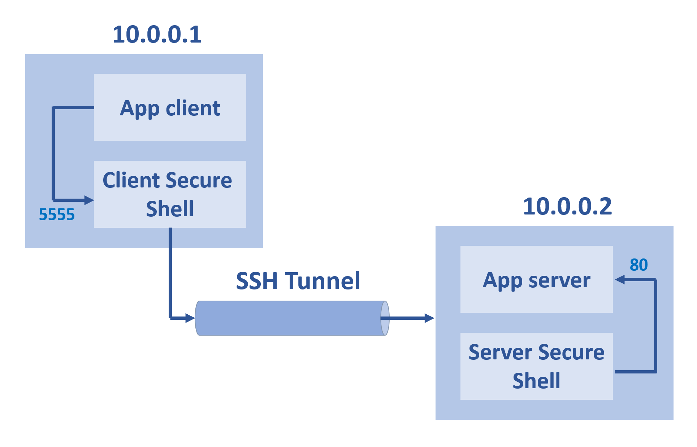
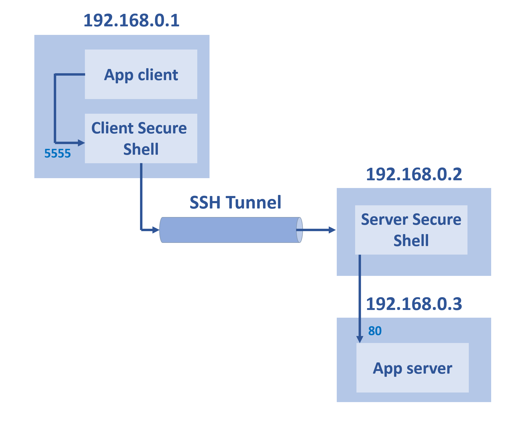
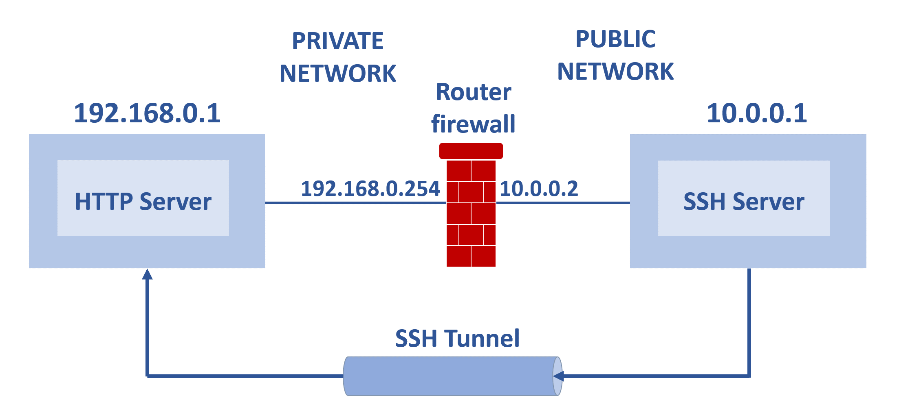
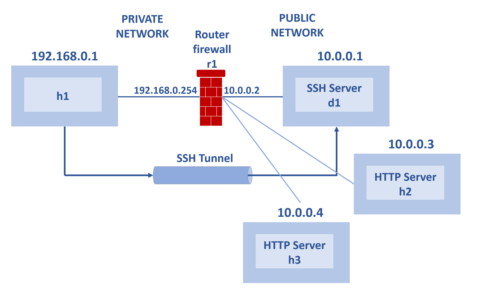

# LINUX WEEK 8 (04-27-2021)
## Notes
### SSH Tunnel
SSH Tunnel is a secure method for connecting a local computer with a remote machine through an encrpted SSH connection. While SSH it self is a standard for secure remote logins and file transfers over untrusted networks. There are three types of SSH Tunneling including :
1. Local port forwarding
2. Remote port forwarding
3. Dynamic port forwarding

## Local Port Forwarding
Local forwarding is used to forward a port from client machine into server machine. In the picture below, the app client and client secure shell both run in 10.0.0.1, and in 10.0.0.2 have both server secure shell and app server running in it. All data that sent to port 5555 (port in 10.0.0.1) is forwarded to port 80 (port in 10.0.0.2).



we can use the following command to build SSH conection between 10.0.0.1 and 10.0.0.2 :

```
$ ssh -L 5555:10.0.0.2:80 user@10.0.0.2
```

While in the picture below, the server secure shell and app server are in different machine. Note that the conection between 192.168.0.2 and 192.168.0.3 is not encrypted.



Type the following command to build SSH conection between 192.168.0.1 and 192.168.0.2 and then would forward the data into 192.168.0.3 :

```
$ ssh -L 5555:192.168.0.3:80 user@192.168.0.2
```

## Remote Port Forwarding
The remote port forwarding will forwards the traffic comming into a port on your server into your local computer, and then it will be sent to the destination host port.



The command to built a remote tunneling is almost the same like local tunneling the difference is remote tunneling using an `-R` parameter.

```
$ ssh -R sourcePort:forwardToHost:destPort connectToHost
```

## Dynamic Port Forwarding (SOCKS)
This tunneling method allows a communication not only on a single port, but across a range of ports. This port dynamic tunneling using an `-D` parameter.



The dynamic tunneling can be built using the following command :

```
$ ssh -D 9000 -f -C -q -N connectToHost
```
Parameters :

`-D` : make SSH to create SOCKS tunnel on port 9000

`-f` : fork the process to background

`-C` : compress the data that would be sent

`-q` : enable quiet mode

`-N` : tells SSH that no command will be sent once the tunnel is up

## Command
### 1). Set firewall to nonactive
to nonactive the firewall, you can use the following command :
```
$ systemctl stop firewalld
```

### 2). Set up web server using SimpleHTTPServer
To set up a web server you can use SimpleHTTPServer, a python module which allows you to instantly create web server or serve your files in a snap.
```
$ python -m SimpleHTTPServer 80
```
The above command would set up web server on port 80.